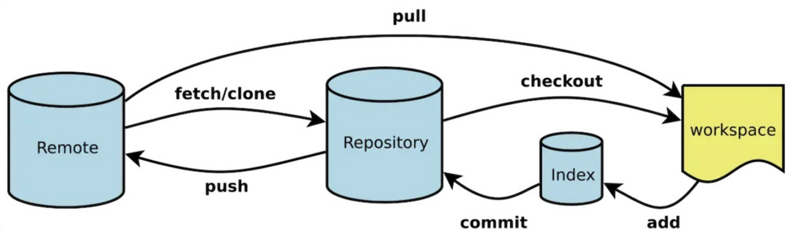
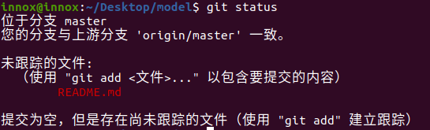
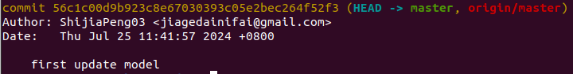

<!-- The <abbr title="Hyper Text Markup Language">HTML</abbr> specification  -->
### abstract

- 如何安装（Windows、Ubuntu）

# introduction

Git 是一种分布式版本控制系统，用于管理软件项目的源代码。它是由 Linux 之父 Linus Torvalds 开发的，并已经成为了现代软件开发领域中最流行的版本控制系统之一。

使用 Git 可以追踪代码的历史修改记录，方便团队协作、代码共享和代码重构。Git 的基本工作流程如下：

- 在开始编写代码之前，首先需要创建一个 Git 仓库（repository），用于存储代码和版本历史记录。
- 在编写代码时，可以通过 git add 命令将更改的文件添加到 Git 的暂存区（staging area）中。
- 通过 git commit 命令将暂存区中的更改提交到 Git 仓库中，并生成一个新的版本号（commit hash）。
- 如果需要撤销某个提交，可以使用 git revert 命令来创建一个新的提交，该提交将会抵消先前的提交效果。
- 如果需要合并不同分支的代码，可以使用 git merge 命令进行合并。
- 如果需要查看代码的历史提交记录，可以使用 git log 命令来获取详细信息。
- 如果需要将代码推送到远程仓库，可以使用 git push 命令将本地代码推送到远程仓库。
- 如果需要从远程仓库中获取代码，可以使用 git pull 命令将远程代码拉取到本地。


- Workspace：工作区
- Index / Stage：暂存区
- Repository：仓库区（或本地仓库）
- Remote：远程仓库

 ---

**目录 (Table of Contents)**

[TOCM]

[TOC]

# 常规操作

### 创建版本库

1. 进入想要管理的Work Space
```bash
cd ws
```
2. 初始化git
```bash
git init
```
3. 将所有的文件添加进入暂存区
```bash
git add .
```
也可以只添加需要管理的文件
```bash
git add <file>
```
4. 提交暂存区的所有文件变更到本地仓库
```bash
git commit -m "变更描述"
```
建议每次提交的时候都将变更详细的描述，这样可以方便对代码进行版本管理

5. 至此，已经完成版本库的创建，下面的一些命令用于对仓库的状态进行查看
- 查看当前工作区和暂存区的状态
```bash
git status
```


- 查看提交日志文件
```bash
git log
```


- 查看分支信息

### 远程仓库基础

1. 将本地仓库链接到github rep上
```bash
git remote add <远程仓库标识符> <远程仓库地址>

# example
git remote add origin  git@github.com..........
```

2. 将代码更改推送到远程仓库中
```bash
git push -u <远程仓库标识符> <分支>

# example
git push -u origin master
```

成功之后，你就会在github仓库里发现你commit的东西了。

